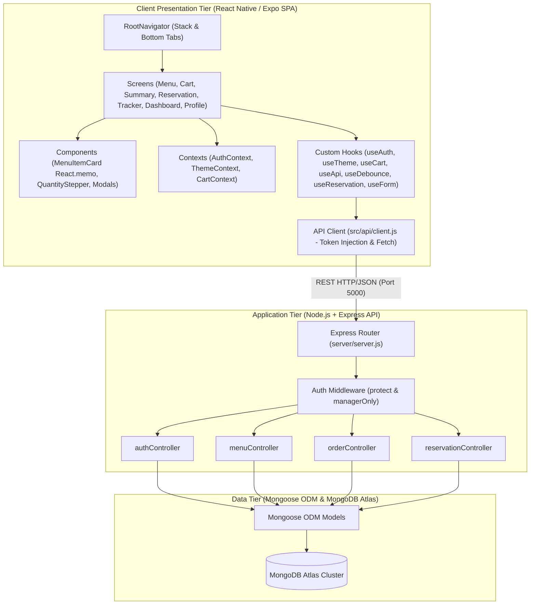

# UML Diagram 5: Component Diagram
**System Architecture:** DASTAAN Multi-Tier Client-Server Component Layout

---

```mermaid
graph TD
    subgraph ClientLayer ["Client Presentation Tier (React Native / Expo SPA)"]
        Nav["RootNavigator (Stack & Bottom Tabs)"]
        Screens["Screens (Menu, Cart, Summary, Reservation, Tracker, Dashboard, Profile)"]
        Components["Components (MenuItemCard React.memo, QuantityStepper, Modals)"]
        Contexts["Contexts (AuthContext, ThemeContext, CartContext)"]
        Hooks["Custom Hooks (useAuth, useTheme, useCart, useApi, useDebounce, useReservation, useForm)"]
        APIClient["API Client (src/api/client.js - Token Injection & Fetch)"]

        Nav --> Screens
        Screens --> Components
        Screens --> Contexts
        Screens --> Hooks
        Hooks --> APIClient
    end

    subgraph APILayer ["Application Tier (Node.js + Express API)"]
        Server["Express Router (server/server.js)"]
        AuthMiddleware["Auth Middleware (protect & managerOnly)"]
        AuthCtrl["authController"]
        MenuCtrl["menuController"]
        OrderCtrl["orderController"]
        ResCtrl["reservationController"]

        Server --> AuthMiddleware
        AuthMiddleware --> AuthCtrl
        AuthMiddleware --> MenuCtrl
        AuthMiddleware --> OrderCtrl
        AuthMiddleware --> ResCtrl
    end

    subgraph DataLayer ["Data Tier (Mongoose ODM & MongoDB Atlas)"]
        MongooseODM["Mongoose ODM Models"]
        DB[(MongoDB Atlas Cluster)]

        AuthCtrl --> MongooseODM
        MenuCtrl --> MongooseODM
        OrderCtrl --> MongooseODM
        ResCtrl --> MongooseODM
        MongooseODM --> DB
    end

    APIClient -- "REST HTTP/JSON (Port 5000)" --> Server
```
