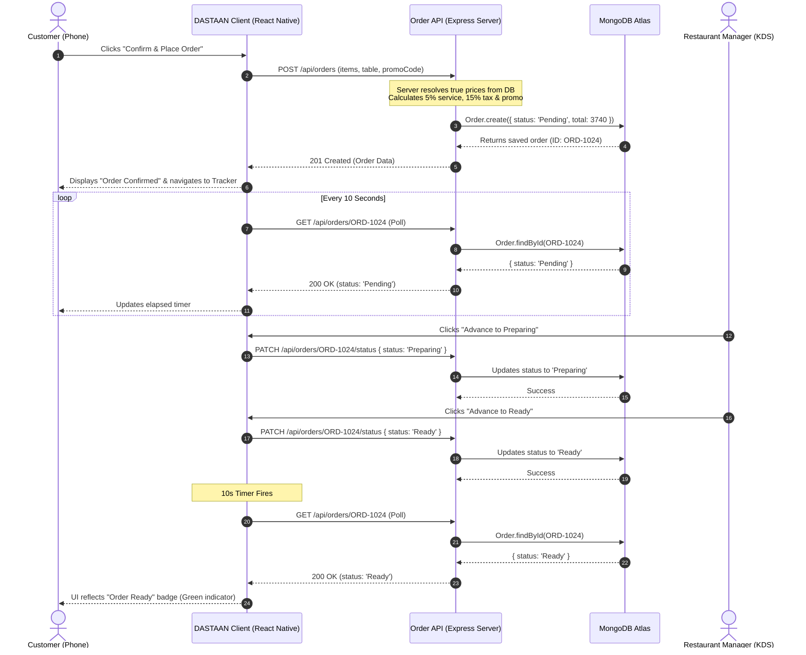

# UML Diagram 3: Sequence Diagram
**Scenario:** Customer Places Order ➔ Manager Advances Status to Ready ➔ Customer Polls Live Status

---

```mermaid
sequenceDiagram
    autonumber
    actor Customer as Customer (Phone)
    participant ClientApp as DASTAAN Client (React Native)
    participant OrderController as Order API (Express Server)
    participant Database as MongoDB Atlas
    actor Manager as Restaurant Manager (KDS)

    %% 1. Order Placement
    Customer->>ClientApp: Clicks "Confirm & Place Order"
    ClientApp->>OrderController: POST /api/orders (items, table, promoCode)
    Note over OrderController: Server resolves true prices from DB<br/>Calculates 5% service, 15% tax & promo
    OrderController->>Database: Order.create({ status: 'Pending', total: 3740 })
    Database-->>OrderController: Returns saved order (ID: ORD-1024)
    OrderController-->>ClientApp: 201 Created (Order Data)
    ClientApp-->>Customer: Displays "Order Confirmed" & navigates to Tracker

    %% 2. Live Polling Loop
    loop Every 10 Seconds
        ClientApp->>OrderController: GET /api/orders/ORD-1024 (Poll)
        OrderController->>Database: Order.findById(ORD-1024)
        Database-->>OrderController: { status: 'Pending' }
        OrderController-->>ClientApp: 200 OK (status: 'Pending')
        ClientApp-->>Customer: Updates elapsed timer
    end

    %% 3. Manager Advances Status
    Manager->>ClientApp: Clicks "Advance to Preparing"
    ClientApp->>OrderController: PATCH /api/orders/ORD-1024/status { status: 'Preparing' }
    OrderController->>Database: Updates status to 'Preparing'
    Database-->>OrderController: Success

    Manager->>ClientApp: Clicks "Advance to Ready"
    ClientApp->>OrderController: PATCH /api/orders/ORD-1024/status { status: 'Ready' }
    OrderController->>Database: Updates status to 'Ready'
    Database-->>OrderController: Success

    %% 4. Next Poll detects Ready status without app restart
    Note over ClientApp: 10s Timer Fires
    ClientApp->>OrderController: GET /api/orders/ORD-1024 (Poll)
    OrderController->>Database: Order.findById(ORD-1024)
    Database-->>OrderController: { status: 'Ready' }
    OrderController-->>ClientApp: 200 OK (status: 'Ready')
    ClientApp-->>Customer: UI reflects "Order Ready" badge (Green indicator)
```
